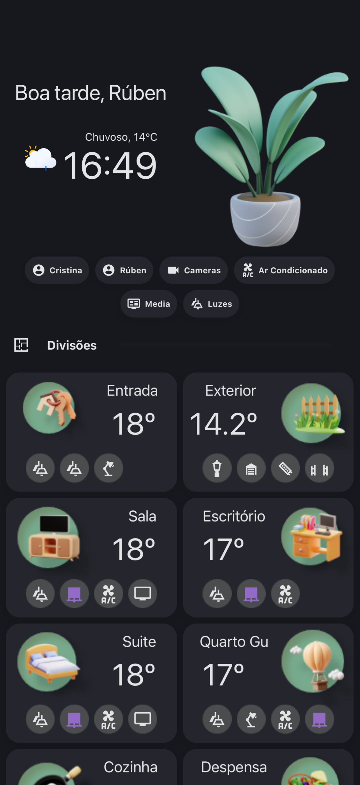
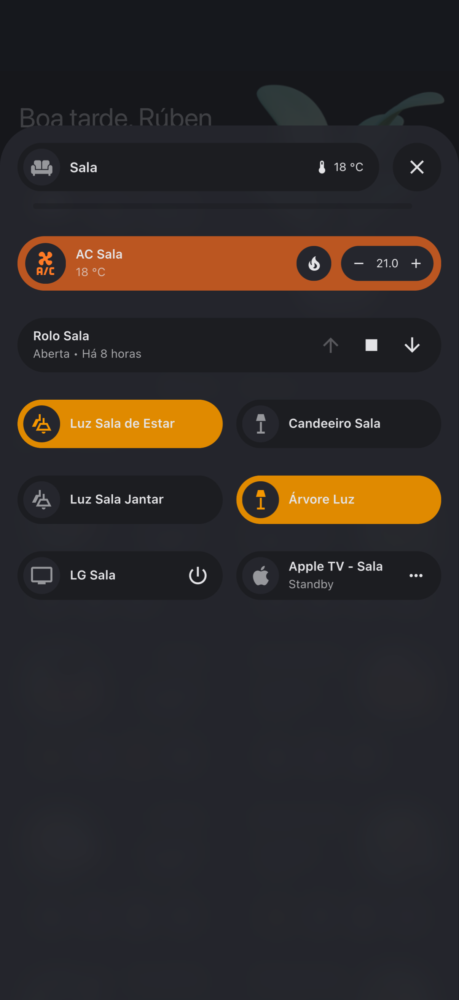
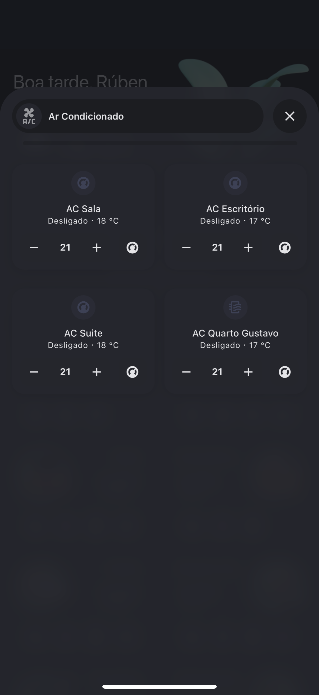
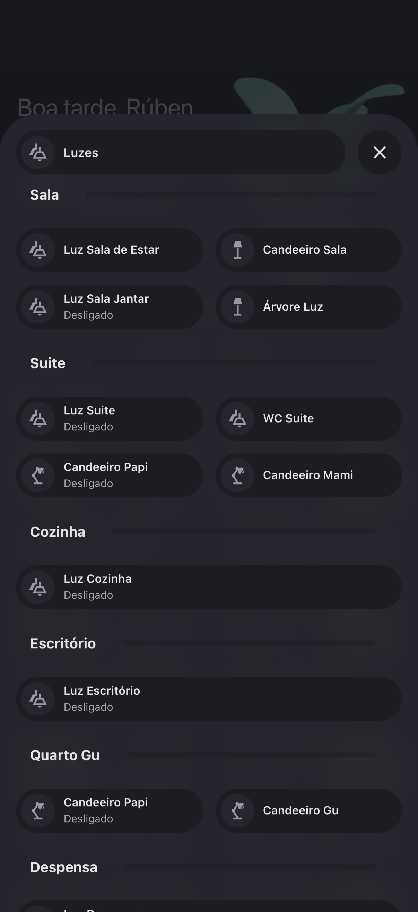
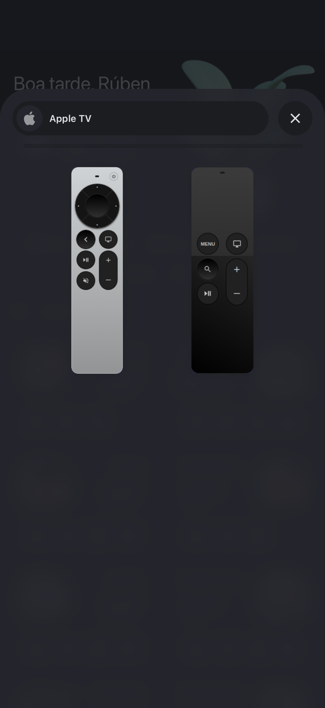
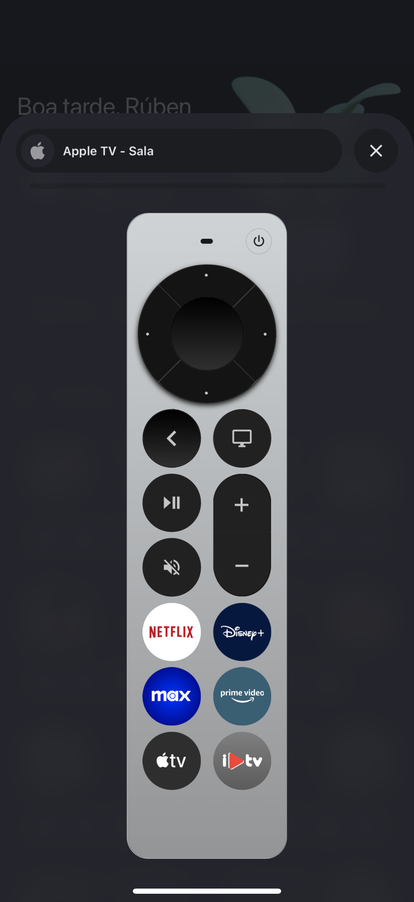
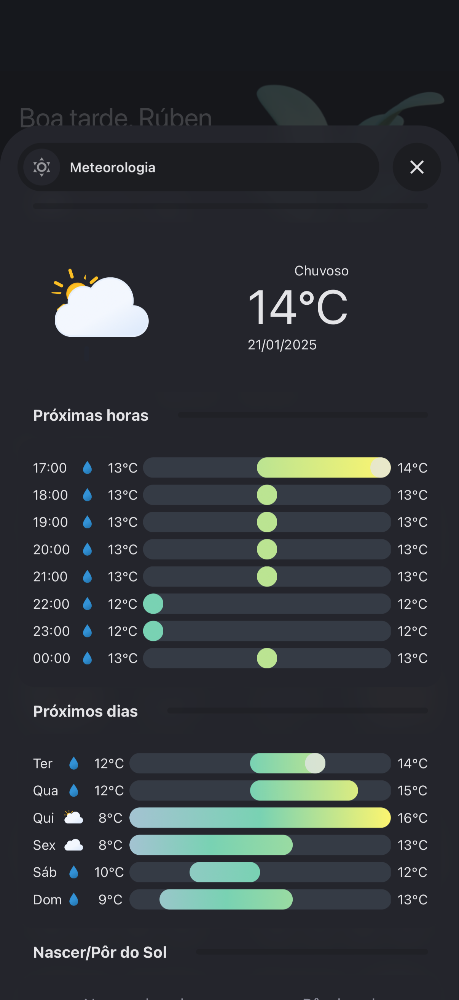
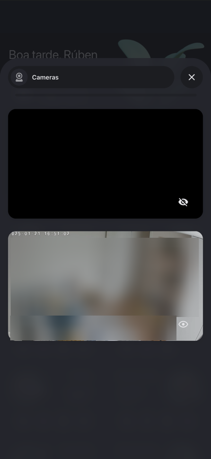

# HA Lovelace Dashboard UI for my deployment

This is just the best way to share my lovelace-ui-dashboard for those who liked it. This way they can take a sneak pic of how I did it.

This is WIP.

## The cards I use

First we need to thank all of those who make HA and kept it free for all of us to use! Second, we need to give props to those who developed the cards I use. They are the ones we need to thank for keeping HA always looking good and working. HACS is a real community!

### The cards

- Bubble card:
    - https://www.reddit.com/r/BubbleCard/
    - https://github.com/Clooos/Bubble-Card/

- Mushroom card:
    - https://github.com/piitaya/lovelace-mushroom

- Button card:
    - https://github.com/custom-cards/button-card

- Card Mod:
    - https://github.com/thomasloven/lovelace-card-mod

- Firemote card:
    - https://github.com/PRProd/HA-Firemote

- Kiosk mode:
    - https://github.com/NemesisRE/kiosk-mode

- Ultra Vehicle Card:
    - https://github.com/WJDDesigns/Ultra-Vehicle-Card

### Youtube channels

I have to thank aswell to this youtubers and for their channels because they are the ones who really teach me what i need to learn in order to do this!

- https://www.youtube.com/@EverythingSmartHome
- https://www.youtube.com/@BeardedTinker
- https://www.youtube.com/@NetworkChuck

### Snapshots

  
  
  
  
  
  
  
  

