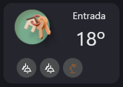

# HA Lovelace Dashboard UI for my deployment

This is just the best way to share my lovelace-ui-dashboard for those who liked it. This way they can take a sneak pic of how I did it.

This is WIP.

## The cards I use

First we need to thank all of those who make HA and kept it free for all of us to use! Second, we need to give props to those who developed the cards I use. They are the ones we need to thank for keeping HA always looking good and working. HACS is a real community!

### The cards

- Bubble card:
    - https://www.reddit.com/r/BubbleCard/
    - https://github.com/Clooos/Bubble-Card/

- Mushroom card:
    - https://github.com/piitaya/lovelace-mushroom

- Button card:
    - https://github.com/custom-cards/button-card

- Card Mod:
    - https://github.com/thomasloven/lovelace-card-mod

- Firemote card:
    - https://github.com/PRProd/HA-Firemote

- Kiosk mode:
    - https://github.com/NemesisRE/kiosk-mode

- Ultra Vehicle Card:
    - https://github.com/WJDDesigns/Ultra-Vehicle-Card

- Clock Weather Card
    - https://github.com/pkissling/clock-weather-card

## Some tips

### Blank sensor

In order to get the the room labels, you need to use a fake sensor that I called blank_blank.
Here's the code:

```
sensor:
  - platform: template
    sensors:
      blank_blank:
        friendly_name: "Blank Blank"
        value_template: " "
```

If you want to use it, you have to add this sensor to _configuration.yml_ file.

### The Room Cards

The room cards is a picture elements card with a lot of images on top of each other to create the button you see.

They are organized in groups of two inside an horizontal stack.



Here's the code of the card named _Entrada_:

```
- type: picture-elements
  elements:
    - type: image
      style:
        left: 20%
        top: 80%
        width: 17%
      image: /api/image/serve/c7214057ab233fb18959af4ecf78e793/512x512
    - type: image
      style:
        left: 40%
        top: 80%
        width: 17%
      image: /api/image/serve/c7214057ab233fb18959af4ecf78e793/512x512
    - type: image
      style:
        left: 60%
        top: 80%
        width: 17%
      image: /api/image/serve/c7214057ab233fb18959af4ecf78e793/512x512
    - type: image
      style:
        left: 30%
        top: 34%
        width: 43%
      image: /api/image/serve/d265d4c5e6102c64fc3a0805195e0f94/512x512
    - type: state-label
      entity: climate.ac_suite
      attribute: current_temperature
      suffix: º
      style:
        left: 75%
        top: 43%
        font-size: 40px
    - type: state-label
      entity: sensor.blank_blank
      style:
        left: 74%
        top: 15%
        font-size: 20px
      prefix: Entrada
    - type: state-icon
      icon: mdi:desk-lamp
      tap_action:
        action: toggle
      style:
        left: 60%
        top: 80%
      entity: light.candeeiro_entrada
    - type: state-icon
      icon: mdi:ceiling-light-multiple-outline
      entity: switch.luz_entrada
      tap_action:
        action: toggle
      style:
        left: 20%
        top: 80%
    - type: state-icon
      style:
        left: 40%
        top: 80%
      icon: mdi:ceiling-light-multiple-outline
      tap_action:
        action: toggle
      state_color: true
      entity: switch.luz_corredor
    - type: image
      style:
        left: 50%
        top: 16%
        width: 100%
      image: /api/image/serve/f4d5e12c6f434eceb78ede028548fc88/512x512
      tap_action:
        action: navigate
        navigation_path: "#entrada"
  image: /api/image/serve/ec615d34f5228cd62fd744c186a8f0a7/512x512
```
### Explaining the elements

- The first 3 images are the background of the small action buttons.
- The 4th image is the background of the icon of the room
- The first state label is the temperature sensor that shows the actual temperature
- The blank sensor is the label (text on top) of the card
- The next 3 state-icons are the action buttons (the ceiling lamps of the hall, the ceiling lamps of the corridor next to it and the desk lamp)
- The next image is a layer I add no top of everything except the action buttons to create a navigation action to navigate to wherever I want.
- The final image is just a completely transparent rectangle I created to give the card the size I wanted and add it to the picture elements as its main image.

I've added a folder with the blank rectangle, the back of the action buttons and the back of the icons.

Feel free to use them.

## Youtube channels

I have to thank aswell to this youtubers and for their channels because they are the ones who really teach me what i need to learn in order to do this!

- https://www.youtube.com/@EverythingSmartHome
- https://www.youtube.com/@BeardedTinker
- https://www.youtube.com/@NetworkChuck

### Snapshots


<div style="display: grid; grid-template-columns: repeat(2, 1fr); gap: 20px; align-items: center;">
  
  
  
  
  
  
  
  
</div>